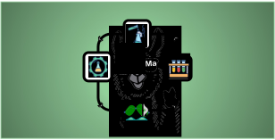

 [](https://doi.org/10.48550/arXiv.2306.06283)


<p align="center">
    
</p>


> Your AI sidekick for integration of expert optimization tools into the chemistry lab.

BOLLaMa, our AI-powered chatbot, simplifies the process of Bayesian Optimization for chemical reactions. It provides an easy-to-use interface that allows users to interact using natural language, removing the need for extensive programming knowledge or complex user interfaces. By offering a more approachable solution, BOLLaMa encourages the widespread adoption of sustainable optimization tools in the chemistry field.

## 📽️ Demo


https://github.com/doncamilom/BOLLaMa/assets/11743428/d0380795-0384-4941-a701-1a41555faa35
The coolest llama! 😎

## 🚀 Installation

Clone and this repo

```bash
git clone https://github.com/schwallergroup/BOLLaMa.git
cd BOLLaMa
```

We recommend creating a conda environment, then install BOLLaMa and dependencies.

```bash
conda create -n bollama python=3.10 -y
conda activate bollama
pip install -e .
pip install graphein
```

## 🔥 Quick start

Setup you OpenAI API key

```bash
export OPENAI_API_KEY=<your-api-key>
```

And you're ready to launch BOLLaMa!
```bash
python app.py
```


